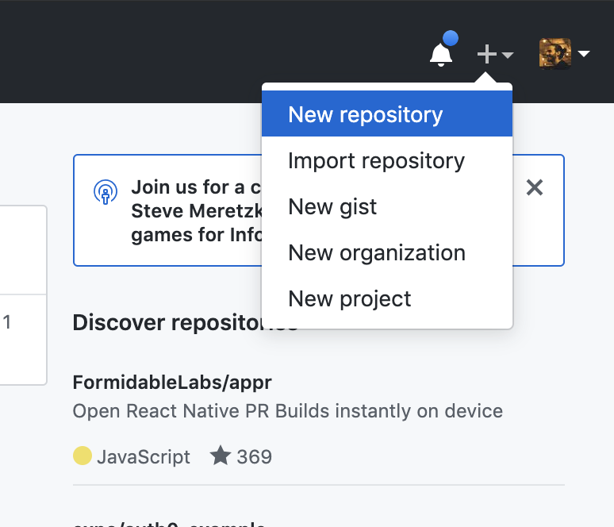
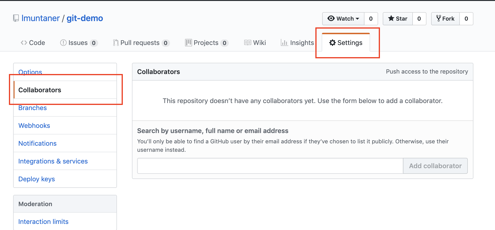
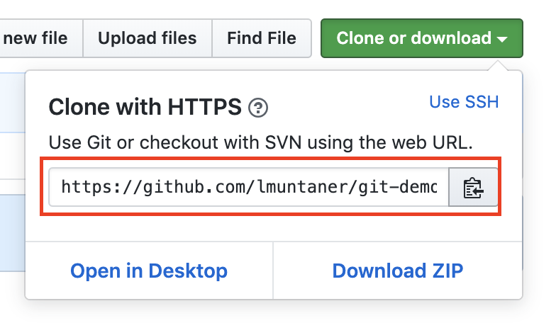
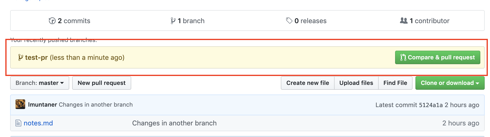

# Project

## Your first test

We are going to use a testing framework called [Jest]()

Follow the steps in the [Getting Started](https://jestjs.io/docs/en/getting-started) section. Only the first part until *Running from command line* not included.

*Yarn is a similar service to npm. Do not use it, when you see npm or yarn, choose npm.*

Check you `package.json` before editing it. You might already have the `scripts` key there. You just need to change the value from `echo \"Error: no test specified\" && exit 1` to `jest`.

## Version control team project

You will need a [Github](https://github.com/) account. Go ahead and register if you don't have one.

### Upload your repository

You are going to upload the repo you created in the [previous exercise on git](./git.md).

Go to Github and create a new remote repository there:



Follow the steps. Add a name to your repo, usually the same as the folder `git-demo`.

The default checkboxes at the beginning are ok.

Now run the commands under *…or push an existing repository from the command line*.

```git
git remote add origin https://github.com/lmuntaner/git-demo.git
git push -u origin master
```

You need to run them from within the folder you created your repository `git-demo`.

After running those commands in the terminal you will see some input. After it has finished, refresh the page you were in.

Now, the file `notes.md` was uploaded to Github.

### Team with a friend

Team with a friend. Both of you are going to work on the same repo.

Choose on of your repos.

#### Owner of the repo

The owner of the repo needs to add the other one as collaborator. This is done in the Tab *Settings* then choose *Collaborators* at the left.



The other one needs to accept the invitation. It will now have access to it.

#### Collaborator of the repo

Once the collaborator has accepted the invitation will need to download the repo to work locally.

Go to the page of the repo and copy the link to the repo. You first need to click on the green button *Clone or Download*.



Choose a folder where you want to download the repo. Navigate with the terminal and run:

```git
git clone <what you copied on Github>
```

*Without the <>*

Execute that and you will see how you download the folder.

You downloaded the git repository already connected to the one on Github.

### Work as a team

Each of you will work on a different "task".

#### Owner

The task is to add a new file `summary.md` and add some text inside it.

#### Collaborator

The task is to modify `notes.md`. Remove a line and add a new sentence at the end.

#### Push your changes to Github

Both owner and collaborator need to follow the same steps. Each of them doing different changes in their branches.

Review the [development workflow](./workflow.md).

Create a branch, commit a few changes and then push it to Github.

To push it to Github you need to run:

```git
git push origin <name-of-the-branch>
```

*Without the <>*.

#### Create a Pull Request

If you visit the page of the repo on Github you will see something new:



Press the button *Compare and Pull Request*. Then *Create Pull Request*.

You did your first Pull Request!!

*The name Pull Request is very misleading, but it's very common. Some services call it Merge Request, which makes more sense*.

#### Merge Pull Request

Now go to the tab *Files changed* and you will see only the changes you made!

The other user, can also go to that page and comment on it. Check out nearby the number of the line that it appears a *+* symbol when you hover it.

By leaving messages is how you discuss those changes. This is also called a **Code Review** if what you are reviewing is code.

Once your team is happy with your changes you can merge it.

Merging a PR can be done from Github, not just from the terminal with `git merge`.

Click tu button *Merge pull request* and confirm it.

You just merged your first Pull Request!

#### Update your local copy

Move to the `master` branch now with `git checkout master`.

Your changes are not there. You need to download them.

However, the branch was already merged on Github. Which means that we shouldn't merge locally.

To update your `master` branch you can run:

```git
git pull
```

You need to run this when you are in the `master` branch. Make sure of that by running `git status`.

After the other person's PR is also merged you should go to `master` and run `git pull` again. There is no need to download the branch that the other person used.
