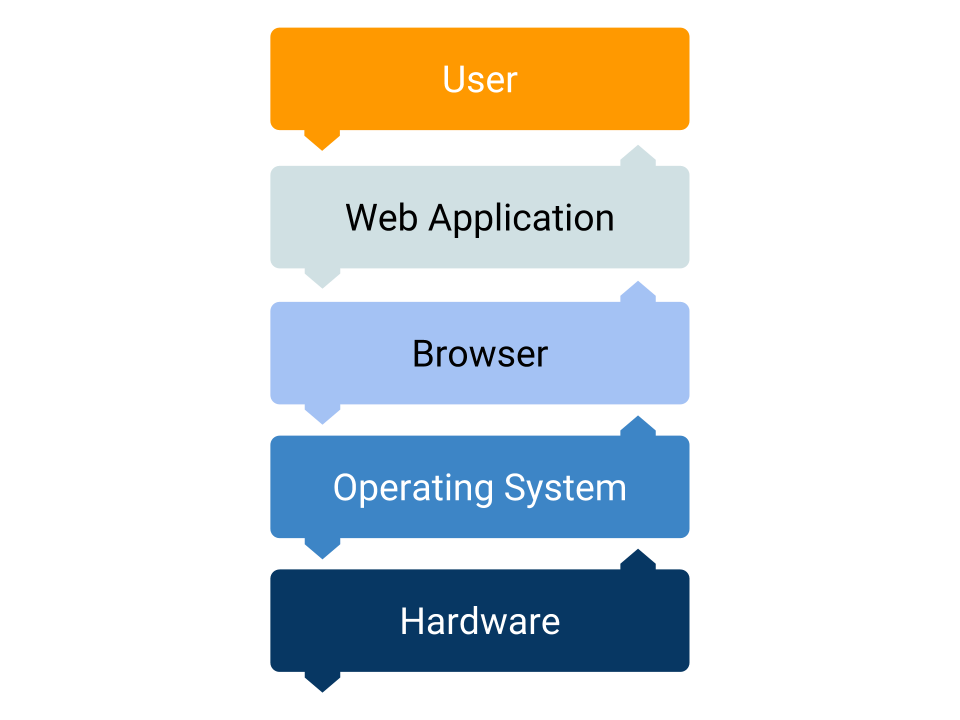

# Browsers

## What is a browser?

Browser are an computer program to navigate Internet.

Their main target is to be able to display HTML pages.

They also handle CSS and Javascript.

## How does it work?

Let's define the steps the browsers follows to show you a page.

We will take a closer look at how all this works in the following modules, but it's good to have an overview at the moment.

### Fetch data

In Internet each page is identified with a specific address, the URL.

When you enter this URL in the address bar, the browser knows where to go and fetch the requested data.

[Read more](https://developer.mozilla.org/en-US/docs/Learn/Common_questions/What_is_a_URL) about what is a URL.

### Receive data

The browser will receive some kind of reply to their request.

When the browser receives the data back, it doesn't know which type it is.

The type (text, html, css, ...) of the requested data is usually sent as metadata. Or also at the beginning of the file. Hence the `<!DOCTYPE html>` at the beginning of an HTML file.

When the browser identifies which type of data it has received, it can start to parse it.

### Parse HTML

An HTML file will be read and it will be converted internally into a big object. The Document Object Model or DOM.

The DOM is the internal representation of the HTML inside the browser.

The whole point of having this DOM is to easily be able to access and manipulate it with Javascript.

While parsing, there might be more orders to go and fetch data.

Each of this orders will start a whole new process of fetching, receiving and parsing.

An example is when it finds either a CSS or a Javascript link:

```html
<!-- CSS Link -->
<link rel="stylesheet" href="./style.css">
<!-- JS Link -->
<script src="./app.js"></script>
```

This will prompt the browser to go and fetch these two files: `style.css` and `app.js`.

**Important:** If an HTML has some errors, they will never be displayed. Parsing an HTML handles any error and ALWAYS shows something.

### Parse CSS

One of the most important part of parsing a CSS file is to create a Layout Tree.

A Layout Tree is similar to the DOM but with the position in the screen for each object.

The creation of the Layout Tree is more complicated than it seems and it takes quite some resources and time to be created.

### Parse Javascript

While parsing HTML, the browser might stop creating the DOM if it finds a `script` tag. If it does, it will execute the code and then move on parsing the HTML.

This part is important for two aspects.

* The browser stops creating the DOM and executes Javascript. When you are writing your code, you need to take that into account.
* The code is executing INSIDE the browser. It runs in the browser environment. Not directly on top of the operating system.

## Web Application

In its beginnings Javascript was used only to add some interactivity with the user.

Hide this button here, move it there, change the color.

Browsers have become so powerful that sometimes you are running a whole computer program inside them. Examples are Gmail, Google Sheets, ...

The browser has become some kind of a smaller OS inside the operating system.

The browser has become a layer between the operating system and the Web Application.



A Web Application is considered a computer program that runs inside your browser.

A Desktop Application is a computer program that runs right on top of the operating system.
