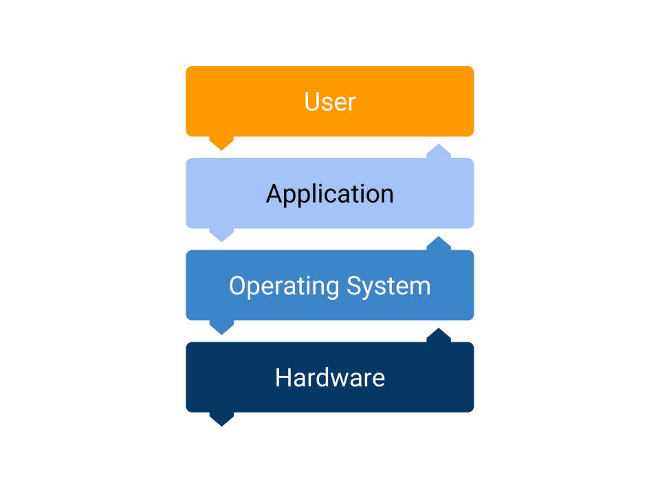

# Software

## Definition

What we call Software are the collection of instructions that are executed in a computer.

Example of software are operating systems, computer programs and libraries.

Software is written in a specific programming language by a human. This language gets "translated" later to a set of instructions for the machine.

## Operating Systems

It is the software that manages the hardware and other software resources. It provides common services for computer programs.

The layer between the hardware and the software that other people develop.

Examples of Operating Systems are: Windows, MacOS, Ubuntu and MS-DOS.

### OS Interface

A user can interact with the OS using different interfaces.

* A GUI or Graphical User Interface. Most common way for most people.
* The Terminal. Text and command way of navigating and performing actions.

The Terminal is used a lot for developers to perform a wide variety of tasks. From navigating folders to starting up a server.

## Computer Program

Software that performs a task. For example Chrome, Excel, Skype, ...

They are also called Desktop Applications. Or in general referred to as Computer Software.

**A Computer Program runs directly on top of the Operating System.**

## Libraries

While a computer program is meant to be used by a human, a library is a piece of software meant to be used by another software.

Libraries are used to develop computer programs or other libraries.

Libraries are just code that someone else wrote.

It's like Lego, once you have built a house, you can use it in another place. They are the building blocks of software.

Unlike in Lego, libraries are extremely easy to reproduce. The developer only needs to download and use the code.

## Open Source

It is a library available for anyone to use for free. More importantly, the code of the library is available for other developers.

This means that others developers can also change that piece of code. This is how a lot of big projects have been developed.

Someone created a library for performing some task and then more and more developers got together to add more functionality and improve the initial program.

A great example of many developers working together to build a big project is [Linux](https://www.linux.org/), the family of Operating Systems.

(Almost) Every developer uses in his daily job Open Source software.

In order to build a website or a server, you might be using only one library. That library in its turn probably relies on many more libraries. Which in turn rely on other libraries. You can see how to tree of dependencies can get very big.

It's amazing the amount of faith and altruism in Open Source projects. It has sometimes backfired, but the idea of stop using Open Source doesn't seem to be not an option anymore.
