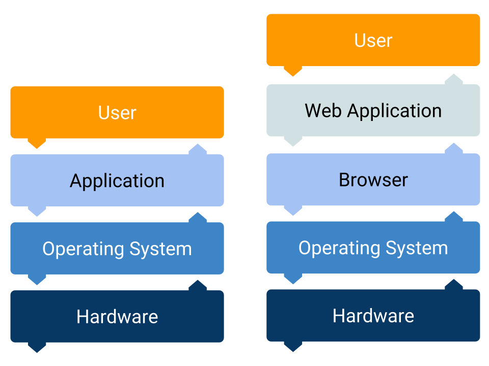

# Wrapping Up

## Computers and Software

Computers are the devices we use to run the software.

The software is written by people using programming languages.

This programming languages are the bridge between developers and computers.

## Operating System and Browser

The operating system is the main piece of software in a computer.

The OS is where the computer programs run.

The browser is a computer program to navigate the internet.

The browser can also execute other software -web applications-.

A web application runs inside the browser, which in turn runs in the OS.

A desktop application runs directly in the OS.
