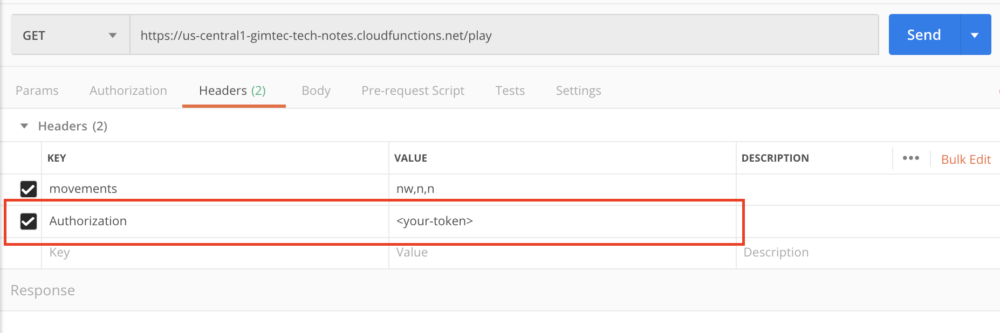
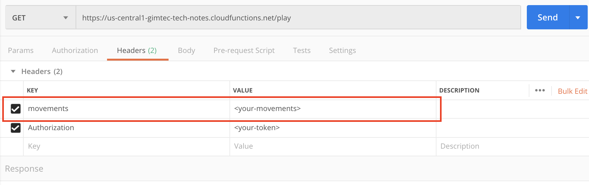

# Save Westeros

You are Daenerys Targaryen and have to save Westeros from The Night King!

**WINTER IS COMING!**

## Game's Interface

The interface of the game is an API. You play by sending requests to it.

## Object of the game

Kill the Night King.

## Login or register

In order to play you need to *register* or *log in* with your user.

You need a token (just some text) to send with your requests. This text is used to prove that you are you.

To get the token you either need to register your email, or login again. The tokens expire.

### Register

Register by sending a `email` and a `password` to the required endpoint:

```shell
https://us-central1-gimtec-tech-notes.cloudfunctions.net/register
```

You need to send a `POST` request with the following body:

```json
{
  "email": "<valid-email>",
  "password": "<some-password>"
}
```

*Remember that to be able to send JSON you need to add the proper `Content-Type` header, value `application/json`.*

*Response:*

```json
{
    "email": "<same-email>",
    "initialRegionId": "<your-initial-region>",
    "id": "<some-id>",
    "token": "<some-large-token>"
}
```

### Login

Login by sending the same `email` and `password` when you registered to the required endpoint:

```shell
https://us-central1-gimtec-tech-notes.cloudfunctions.net/login
```

You need to send a `POST` request with the following body:

```json
{
  "email": "<your-email>",
  "password": "<your-password>"
}
```

*Response:*

In the response of the login you find the same information as in the register.

```json
{
    "email": "<same-email>",
    "initialRegionId": "<your-initial-region>",
    "id": "<some-id>",
    "token": "<some-large-token>"
}
```

### Token

Check how both responses from *login* and *register* send back a *token*.

This is the token needed to play. You need to include it in every request you do.

The header name is `Authorization` and the value is the token received.

In Postman:



### Initial Region

In the responses check out as well the key `initialRegionId`. This is the region where you start your quest.

Any movements start from that location.

## Getting Started

Once you have the token you can start playing the game.

Read until the end before start playing.

### Map

You start in a specific region and need to move in the map to perform the challenges.

The map is more or less similar to [this](https://awoiaf.westeros.org/index.php/File:Agot_hbo_guide_map.jpg). In case you are not very familiar with the TV Show or the Books.

### Start playing

By doing a GET request you can see where you are. The url to play is:

```shell
https://us-central1-gimtec-tech-notes.cloudfunctions.net/play
```

An example of a response is this one:

```json
{
  "region": "The Riverlands",
  "message": "No one is here. Everybody has left. Winter is coming!"
}
```

*Authorization header:*

Remember to set the Authorization header with the token to prove that you have a registered.

### Response status

There are two different response status when the request is successful.

* **200** When you got all the information there is to have from that region
* **202** When there are still some hidden information. For example, when there is a character and still need to give you the hint.

### Move

You have 8 directions to move:

* North with `n`
* South with `s`
* East with `e`
* West with `w`
* North-East with `ne`
* North-West with `nw`
* South-East with `se`
* South-West with `sw`

You need to send your movements in a custom header.

The name of the header is `movements`. You can send more movements by adding `,` in between. For example: `s,s,ne` for moving south, south and north-east.

By sending a set of movements, you receive information about the other regions.



### Special Regions

Some regions have characters waiting for you. These will be explained below.

An example of response when the region has a character is:

```json
{
  "region": "The North",
  "message": "Tyrion Lannister: <Some Question or proposal before giving you a hint>"
}
```

*Status 202:*

If you receive a **202** from your request, it means that you didn't do the request properly to get the hint.

To get the hint you might have to do the request with the same movements, but change your request slightly:

* Another method instead of GET
* Add some query param
* Add a custom header
* Send something in the body

Or a combination of two or more.

*Status 200:*

When you succeed getting the hint to kill the Night King you will get a status of **200**.

## Objective of the game: Kill The Night King

You need two things:

* **Find him.** Which movements you need to get to him. In which region is he hiding?
* **Request prerequisites.** Which method, body, headers or query parameters you need to kill him.

### Find him

To find him there is no other way than doing requests with `movements` and checking the regions until you find him.

There might be some movements that take you out of the map or nowhere. The API will warn you about those.

### Request prerequisites

Once you know the movements to get to the Night King you need to kill him.

You need to do the right request:

* Which HTTP Method?
* Does it need some body?
* Some special header?
* Any additional query parameters?

### Challenges

You need to gather this requirements by solving other challenges.

#### Join Jon Snow

When you find him, he will tell you how to join forces with him to kill The Night King.

He will then give you one of the requirements to kill The Night King.

An example is that he might tell you which query params you need to pass if you want to kill The Night King.

#### Party with Tyrion

Same deal. Find Tyrion. He will tell you how to party with him.

#### Borrow money from the Iron Bank

You need to find the emissaries of the Iron Bank and borrow money from them.

#### Flatter Cersei

Last but not least you need to deal with Cersei.

Good luck with that one!

## Conclusion

Remember that each request is stateless. Which means that it doesn't remember where you are.

**You always start from the initial region.**

That means that you need to send always the movements from the initial region.

Good luck and remember **WINTER IS COMING!**
