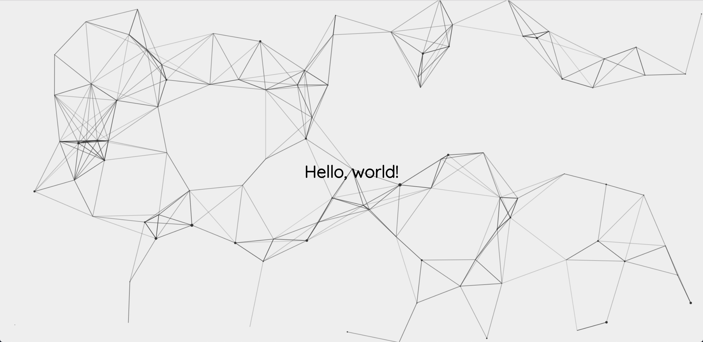

# Your first Website

In this small project you are going to create a small website.

## Setup

Use a text editor to open and edit the files.

The recommended is [VSCode](https://code.visualstudio.com/).

You can also try [Atom](https://atom.io/) or [Sublime](https://www.sublimetext.com/). Or any other if you are already familiar with text editors.

## 1. Create an html file

Create a folder to hold your files.

Create a file called `index.html` in it.

Add the required `html` tags learned in the readings: `<!DOCTYPE html>`, `<html>`, `<head>`, ...

Inside the `<body>` tag. Insert the following:

```markup
<div>
  <h1>Hello, world!</h1>
</div>
```

**Open the file.** Double click on the file and it should be opened by your default browser.

## 2. Add some style

Create an `style.css` in the same folder.

Link it in the `index.html` with the `<link>` tag. _Review the readings on how to add a CSS file to your site if needed._

Add a background to the whole page.

Go to [coolbackgrounds.io](https://coolbackgrounds.io/) for some cool backgrounds. If you choose either triangles or particles and click download you will get a `.png`.

Move the downloaded image to the same folder.

Add it as background image.

```css
html {
  background: url(./cool-background.png) no-repeat center center fixed;
  -webkit-background-size: cover;
  -moz-background-size: cover;
  -o-background-size: cover;
  background-size: cover;
}
```

## 3. Position the title

Let's move the title of `Hello, world!` to the middle of the page.

First, remove some default margin set to the `body` tag:

```css
body {
  margin: 0;
}
```

This has probably just moved a little bit your text. Not much.

Let's add a class to our `div` wrapping the `h1`.

```markup
<div class="container">
  <h1>Hello, world!</h1>
</div>
```

_This step is not strictly necessary, since we could select the_ `div` _with a tag selector. But it's a good practice._

Make it as big as the screen:

```css
.container {
  height: 100vh;
  width: 100vw;
}
```

Place the element inside it in the center:

```css
.container {
  height: 100vh;
  width: 100vw;
  display: flex;
  align-items: center;
  justify-content: center;
}
```

_Careful with typos. CSS and HTML never show errors. Things might just not work because you misspelled_ `container` _for_ `contaier`_._

This should have placed your title in the middle of the screen.

## 4. Style the title

First, let's change the font.

To do this, you will need two steps:

* Embed the font
* Use it with CSS

Go to [Google Fonts](first-html.md) select one.

Embedding means adding a `link` tag in the `head`.

```markup
<head>
  ...
  <link rel="stylesheet" href="./style.css">
  <link href="https://fonts.googleapis.com/css?family=Quicksand" rel="stylesheet">
  ...
</head>
```

Use it in CSS:

```css
body {
  margin: 0;
  font-family: 'Quicksand', sans-serif;
}
```

Depending on the background you might want to change the color of the title. In the solution didn't do that.

## Result

This is the outcome of the solution.



