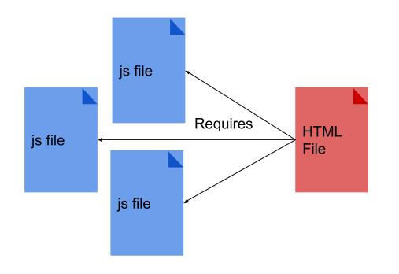
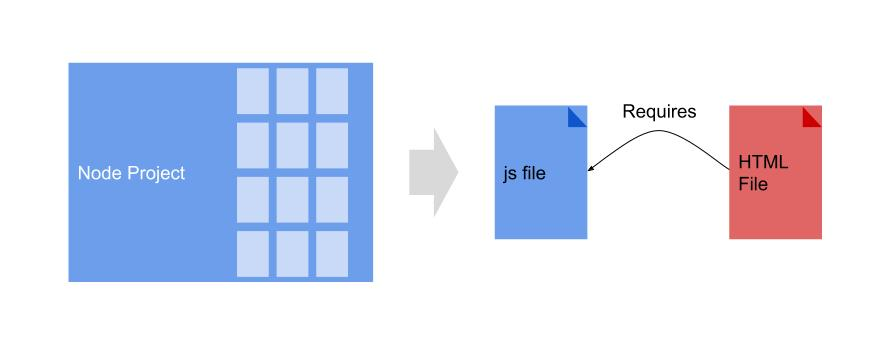
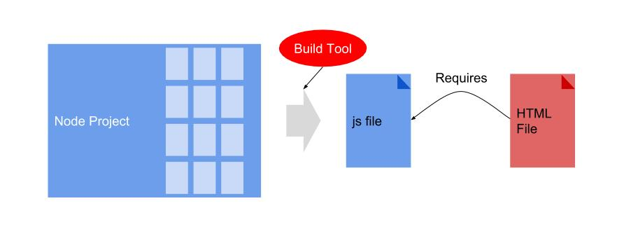

# Current Frontend development

## SPA Development

SPAs and Multi Page Applications are not only different for the end user, but also during their development process.

SPAs load all the javascript at once. For all the "pages" or routes. They are an application in itself.

Frontend in SPAs is a project in itself. It's not just some Javascript in this page and that page. It is a whole application running in the browser. Similar to a Desktop application.

The complexity of frontend development has increase with SPAs.

In traditional web development, the developers would write Javascript in different files which would then be linked in the HTML that would use them.

Libraries were also linked in the HTML page that was using them.

However, this changed in the past years.

Now, [NodeJS](https://nodejs.org/en/) is used to build the javascript file that will be sent to the browser.

## Build tools

Build tools are used to automate tasks. Most specifically, they are used to create the single file from the Node project that will be sent to the browser.

In our previous drawing, the build tool is used in the process to create the single file.

Build tools are not only used for this. They are also used for other tasks:

* Translating from one Javascript version to another
* Modifying the `<script>` tag in the HTML page automatically
* Bundle all the CSS together
* Run unit tests
* Minify Javascript and CSS files

Examples of build toold are [Webpack](https://webpack.js.org/), [Gulp](https://gulpjs.com/) and [Grunt](https://gruntjs.com/)

## Frontend Frameworks

Another tool that has helped manage the complexity of this new frontend applications are frameworks.

Frameworks are a set of libraries (it can also be considered one library) that work together to provide a specific functionality.

Each framework usually comes with a different mental model on how to build your application.

Like any other tool, you are not productive until you have learned it. Some frameworks can have a steeper learning curve than others. That's why developers need to assess whether learning the tool makes sense in the long run.

Examples: [VueJS](https://vuejs.org/), [React](https://reactjs.org/), [Angular](https://angularjs.org/) and [EmberJS](https://emberjs.com/).
