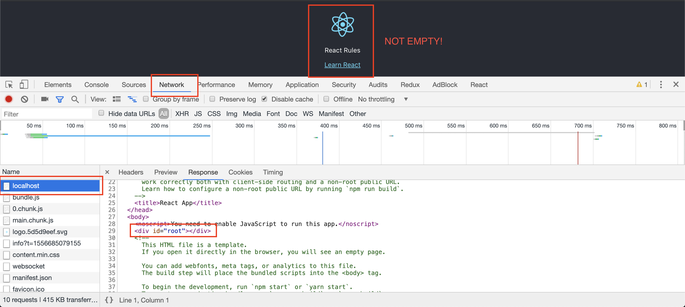
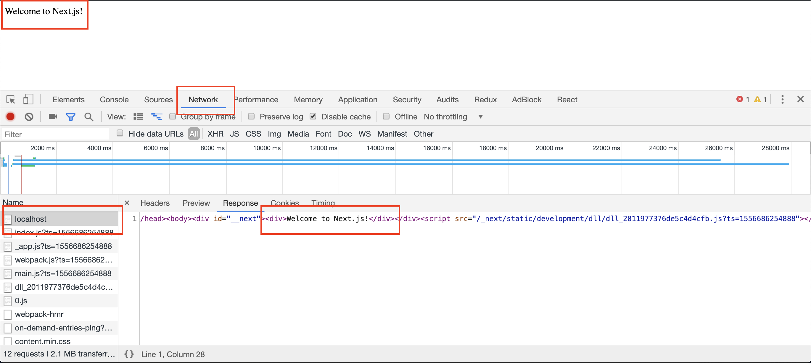

# Project

There are two exercises in this module. First regarding build tools and the second one to frontend frameworks.

## Build Tool Project: Webpack

Follow along the [Getting Started](https://webpack.js.org/guides/getting-started/) with Webpack, until *Modules* not included.

### Optional

Finish all the Webpack [Getting Started](https://webpack.js.org/guides/getting-started/)

## React Application

Create a React Application follow [these](https://reactjs.org/docs/create-a-new-react-app.html#create-react-app) guidelines.

Visit your application in `http://localhost:3000/`.

Open the folder with your text editor.

Go to `public/index.html`. You can see the empty `

` in the `body`. It has none of the content displayed in the browser.

Try to find where the text *"Edit src/App.js and save to reload."* is and change it to *"React Rules"*.

### React: Check server response

Open the page with Chrome. Open the Dev Tools -right click and "inspect"-.

Go to the *Network* Tab. Refresh the page.

Check the item called *localhost*. This is the response to the first request. The HTML sent by the server.

The server sends it empty. However, we can see that the page has content. This content is rendered in the client side.

This is **client side rendering**.

## NextJS Application

Follow along the getting started in the [NextJS Docs](https://nextjs.org/docs). Until *Automatic code splitting* not included.

### NextJS: Check server response

When you have `localhost:3000` do the same steps as previously to check the *Network* tab in the DevTools.

You can see now how the HTML sent by the server has the same content seen in the screen.

This is **server side rendering**.

Try changing *Welcome to NextJS!* with something else and you will also see it in the response.

## Gatsby Website

Follow the [getting started](https://www.gatsbyjs.org/docs/quick-start) from GatsbyJS page.

When prompt with *Which package manager would you like to use* choose `npm`.

No need to do anything in *Access documentation for CLI commands*.

### GatsbyJS: Check server response

Same as before, check the response in the *Network* tab.

### GatsbyJS: Check static files

After running `gatsby build`, it will create the static files that need to be served to the client in the `public` folder.

Open the project with a text editor and open `public/index.html`.

You will see that it's kind of a mess. Search within that file for *Hi people*.

As you can see, the file in the folder `public` is the same as the one received in the client.

This means that the server is only sending the file inside `public`. Is not doing anything else.

Creating the files with a command such as `gatsby build` is called **build time rendering**.
