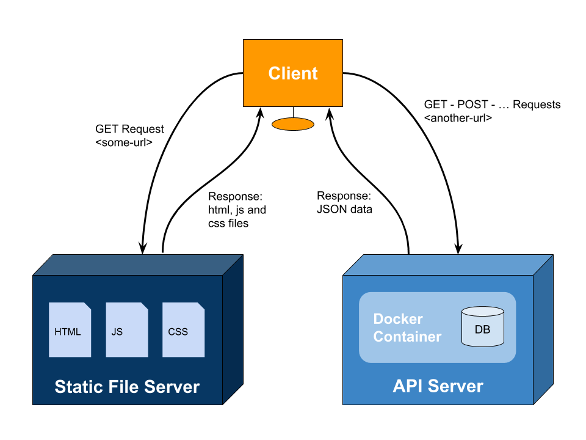
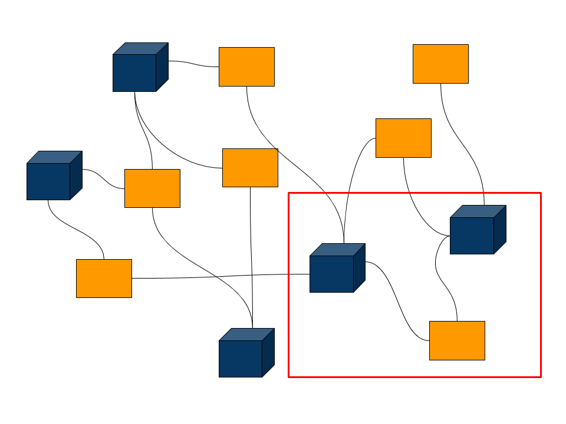

# Wrap Up

I hope you enjoyed these notes and learned something from it.

If you made it this far you are probably tired of reading.

Instead I'd rather present you a schema summarizing most of it.

This would be the architecture of a SPA with client side rendering, talking to an API server running in a container with a SQL data base.

*The fact that you understood the previous sentence might already give you an idea of how much you learned :)*.

Taking a step back and visualizing this in the context of the World Wide Web:

To end this module there is one [final project](./project.md).
